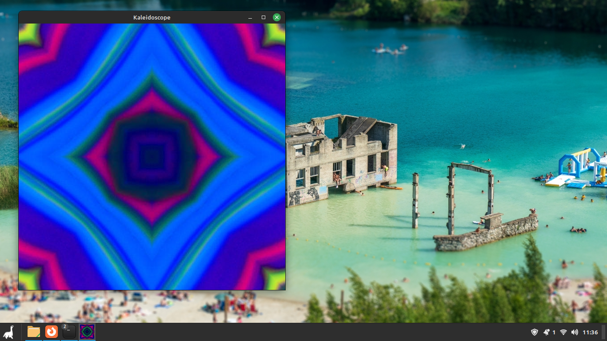
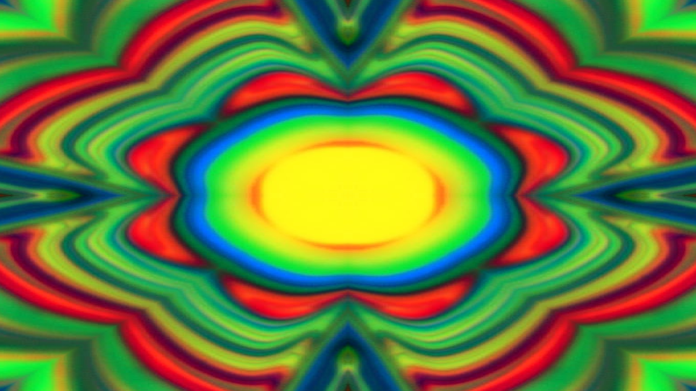

# Kaleidoscope
## What?
A kaleidoscope program! it does not reflect in hexagon shape (I didn't know how to do it, maybe in the future?), it mirrors a section jumping around the image diagonally, then vertically and horizontally. The image can be any image with height larger than half window height and the same for width, png o jpeg.

## Usage
By default the program runs windowed but flag "--fullscreen" makes it fullscreen.

## Why?
To entertain myself with something (though I should be studing...), and this way I don't have to search videos of kaleidoscopes in youtube and suffer the low resoution and framerate. The program runs at 240 FPS, so it is pretty smooth.

## Dependencies!
You should have SDL2 main and image library installed. The packages may be called libsdl2-dev and libsdl2-image-dev.

## Installation
just "make" should "install" (generate the binary and put it in the same diretory) it. It should compile and run on windows, did not test it.

